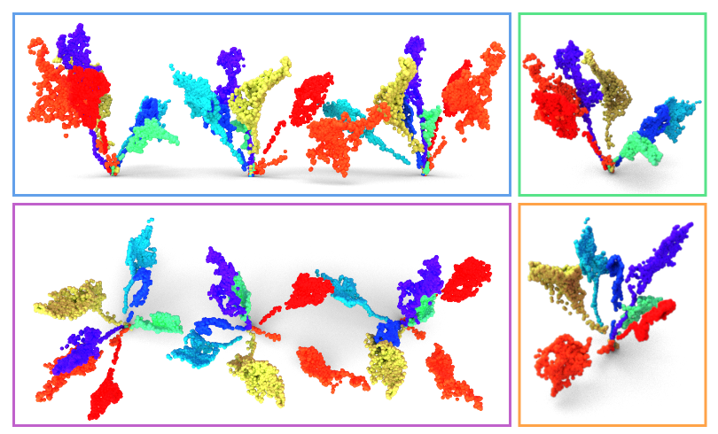

<div align="center">
    <h1>Generation of Labeled Leaf Point Clouds for Plants Trait Estimation</h1>
    <br />
    
    <br />
    <a href=https://www.ipb.uni-bonn.de/wp-content/papercite-data/pdf/roggiolani2025pp-and-suppl.pdf>Paper</a>
    <span>&nbsp;&nbsp;•&nbsp;&nbsp;</span>
    <a href=https://github.com/PRBonn/3dLeafLabGen/issues>Contact Us</a>
  <br />
  <br />
</div>

## Setup

Build docker image:

```commandline
make build
```

You may need to [install the NVIDIA container toolkit](https://docs.nvidia.com/datacenter/cloud-native/container-toolkit/latest/install-guide.html) to bring the GPUs to work with Docker.

## Data Samples and Weights

We provide one leaf point cloud with the extracted skeleton. The same leaf-skeleton pair is replicated inside the 'data/val' and 'data/train' folders, this is needed to use the distribution losses that need more than one sample to work.

With this leaf one can test the data loading, training, and testing with the provided network's weights. To perform a full training, one can download the [BonnBeetClouds](https://bonnbeetclouds3d.ipb.uni-bonn.de/) or the [Pheno4D](https://www.ipb.uni-bonn.de/data/pheno4d/index.html) dataset and extract the leaves skeletons. 

We also provide the checkpoints for computing the generative metrics that we use in the paper.

### Option 1: Manual download
Download the data here: [data.zip](https://www.ipb.uni-bonn.de/html/projects/roggiolani2025pp/data.zip),

the weights here: [best.ckpt](https://www.ipb.uni-bonn.de/html/projects/roggiolani2025pp/best.ckpt),

the checkpoint for PointNet here: [pointnet_on_single_view.pth](https://www.ipb.uni-bonn.de/html/projects/roggiolani2025pp/pointnet_on_single_view.pth),

and the checkpoint for 3D+CLIP embeddings here: [pointmlp_8k.pth](https://www.ipb.uni-bonn.de/html/projects/roggiolani2025pp/pointmlp_8k.pth).

Unzip data.zip and copy the folder data and the weights into the main folder, copy the checkpoints in the src/metrics folder.

### Option 2: Automated download

Execute
```commandline
make download
```

## Test the generation

You can test the point cloud generation running

```commandline
make generate
```

## How to train the network 

You can train the network running 

```commandline
make train
```

By default this will use the leaves in `data`, where there are three defined folders train, val, test.

## How to Compute Metrics

You can compute the metrics between the leaves in `data` and the generated leaves (you need to first generate the samples!) running

```commandline
make compute_gen_metrics
```

By default this will try and compare up to 1.000 leaves, using the 3D+CLIP model for all three metrics: FID, CMMD, improved Precision and Recall. The realism for precision and recall is set to 0.5. 

All these parameters can be changed / passed to the file compute_generative_metrics.py.

## Efficient Target Computation

We also provide the script to compute and save the embeddings extracted from the training data to used them during training to compute the distribution losses. You can compute this running 

```commandline
make compute_target
```

This automatically save a tensor with the name of the dataset in the `metrics` folder.  

## Configuration Files

Notice that in the config folder there are three configuration files:

1. config_bbc.yaml: dataset configuration file for training the network, it specifies information about the real-world data, the network parameters, the size of the used skeletons
2. test_config.yamls: configuration used to compute the generative metrics, it specifies the location of the real-world data and of the generated samples
3. generate_config.yamls: configuration for the generative procedure, it specifies information about the type of leaf skeleton and about the network


### Style Guidelines

In general, we follow the Python [PEP 8](https://www.python.org/dev/peps/pep-0008/) style guidelines. Please install [black](https://pypi.org/project/black/) to format your python code properly.
To run the black code formatter, use the following command:

```commandline
black -l 120 path/to/python/module/or/package/
```

To optimize and clean up your imports, feel free to have a look at this solution for [PyCharm](https://www.jetbrains.com/pycharm/guide/tips/optimize-imports/).

